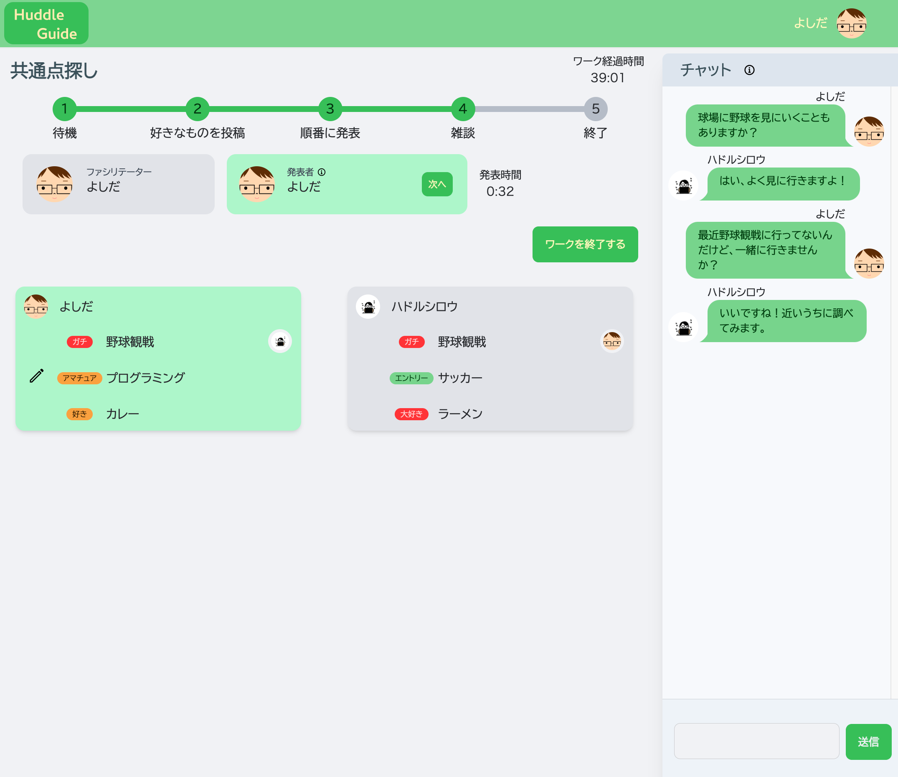
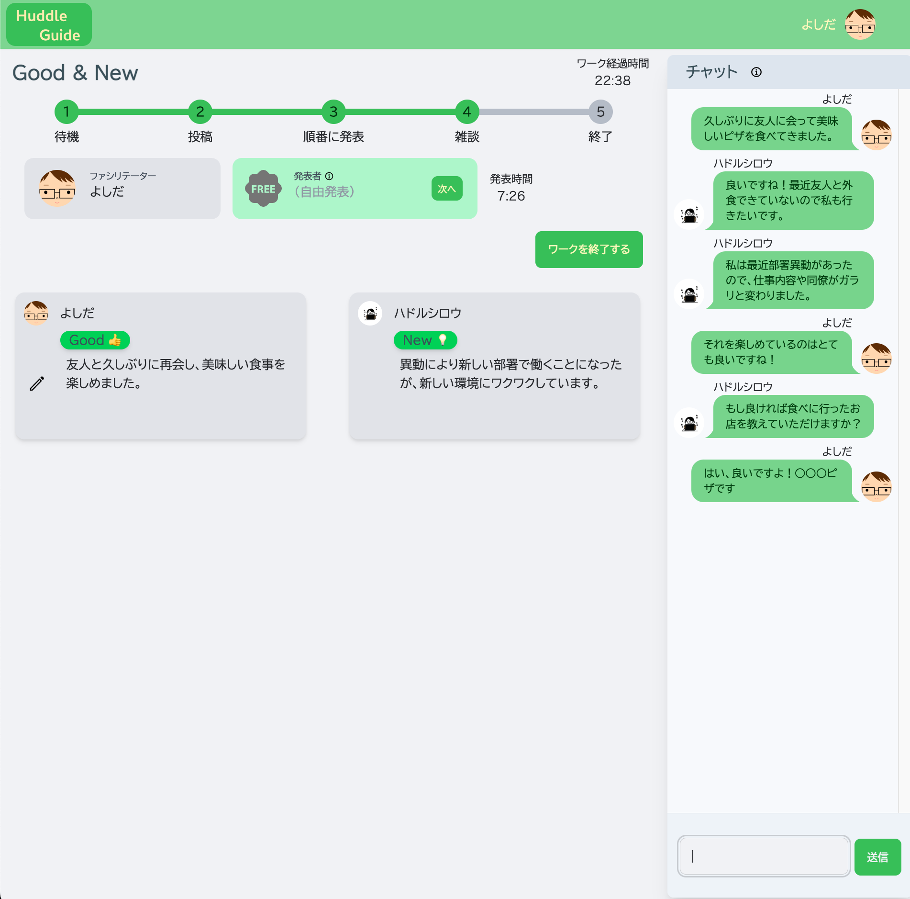
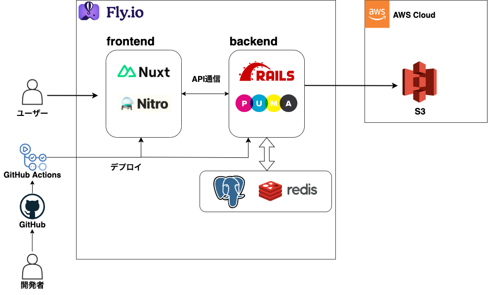
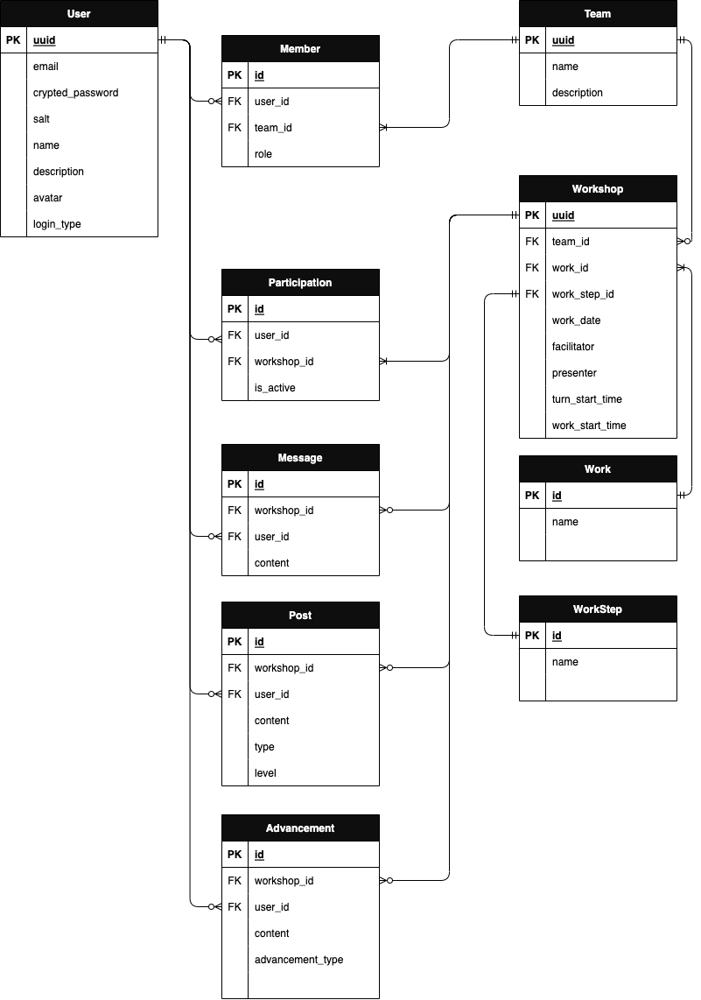

# Huddle Guide
Huddle Guideはチームメンバーの共通点を発見したり、  
日々あった新しいことを同期的に共有することでチームビルディングを行えるサービスです。

  
**サービス URL**  
https://huddle-guide.com

---

## ユーザーが抱える課題

- オンラインで仕事するメンバーとのコミュニケーションのきっかけが作りにくい。  
- リモートワークする中で業務に関する連絡だけに留まってしまい、どこか壁があるように感じる。  
- オンラインのミーティングや交流会では特定の人物が主で話してしまい、発言しにくい。  

---

## 主な機能

## 共通点探し

ワークに参加した各ユーザーが、自分の好きなもの・そのレベル感を3個まで投稿します。  
共通の趣味が見つかるとアバターが表示されるため、積極的に共通点を探してみることも可能です。  

## Good & New

日々過ごす中であった、良かったことや新しく発見したことをメンバーにシェアしましょう。

### 各ワークでの共通機能
- **ステップ変更機能**  
ワークのステップを変更することができ、今何を行う時間であるかを画面上に表示します。

- **タイマー機能**  
ワーク開始からの時間と、各発表者の発表時間を画面で確認することができます。  
ファシリテーターは一人の発表時間や、ワークの時間が長くなりすぎないようにタイムキープしましょう。

- **チャット機能**  
ワークでのコミュニケーションとしてチャット機能を設けていますが、音声・ビデオ・チャットについては他のコミュニケーションツールで代用することも可能です。

### その他機能
- ユーザー登録・編集機能（Googleログイン含む）
- チーム作成・編集・削除機能
- ワークショップ機能
- SNS投稿機能

---

## 主な使用技術

### フロントエンド

- [Nuxt](https://nuxt.com/)
- [Vue.js](https://vuejs.org/)
- [TypeScript](https://www.typescriptlang.org/)
- [TailwindCSS](https://tailwindcss.com/)
- [daisyUI](https://daisyui.com/)

### バックエンド

- [Ruby on Rails](https://rubyonrails.org/)
  - APIモード
  - ActionCable(ワーク内のデータをリアルタイム通信)

### インフラ

- [Fly.io](https://fly.io/)
- [AWS](https://aws.amazon.com/jp)
  - [S3](https://aws.amazon.com/s3/)

### CI/CD

- [GitHub Actions](https://docs.github.com/ja/actions)

---

## インフラ構成図

---

## ER図

---  
  
## 画面遷移図

[figma](https://www.figma.com/file/RcDHHadQXXwEub541ZVmCX/Huddle-Guide?node-id=0%3A1&t=6kkDHQpxN2BYMgvY-1)

